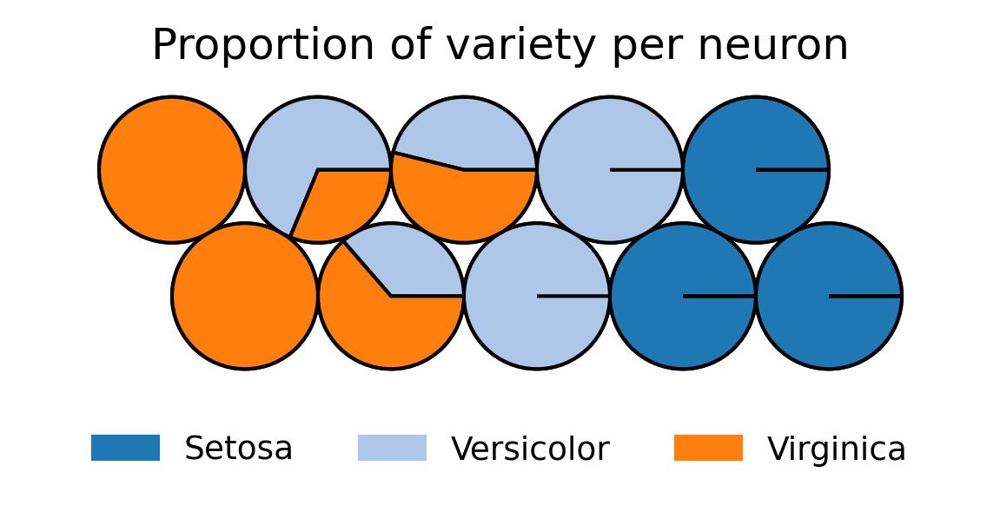

# Self-Organizing Maps (SOM)

This repository provides an implementation of Self-Organizing Maps (SOMs), a clustering and visualization tool for high-dimensional data. The framework includes utilities, example scripts, and sample data to demonstrate the SOM's capabilities.

## Directory Structure

``` bash
SOM/
├── utils/
│   └── som_utils.py 
├── data/              
│   ├── iris_categorical_data.csv          
│   ├── iris_training_data.csv     
│   ├── seq_sim_categorical_data.csv
│   ├── seq_sim_training_data.csv 
│   ├── titanic_categorical_data.csv
│   └── titanic_training_data.csv 
├── examples/           
│   ├── output/
│   │   ├── iris/
│   │   ├── seq/
│   │   └── titanic/
│   ├── som_example_iris.py
│   ├── som_example_seq.py
│   └── som_example_titanic.py             
└── som.py                  
```

## Features

- **SOM Implementation**: The `utils/som_utils.py` file contains the `SOM` class, which provides comprehensive functionalities for scaling data, training and visualizing Self-Organizing Maps.
- **Command-Line Interface**: The `som.py` script allows users to run SOM operations directly from the command line, supporting tasks like hyperparameter tuning, clustering, and visualization.
- **Examples Directory**: The `examples` directory includes scripts that demonstrate how to use the `SOM` class for clustering and visualizing datasets such as Iris, Titanic, and single-cell RNA sequencing. These examples serve as templates for applying the SOM framework to your own data.
- **Data Samples**: The `data` directory contains preformatted datasets used in the example scripts, providing a starting point to explore and test the functionality of the SOM framework.


## What is a SOM?

A SOM is a type of unsupervised neural network, designed to cluster and represent data by grouping similar data points. Unlike traditional clustering methods, SOMs map complex, high-dimensional datasets onto a simplified two-dimensional grid. This makes SOMs a valuable tool for identifying patterns and relationships within complex datasets.

<div align="center">
    <br>
    
    <br>
    <a href="https://ritikpatel17.medium.com/self-organising-maps-a-brief-overview-6f6ff3c0168a">Image Source</a>
</div>

## How do SOMs work?

SOMs create a **grid of neurons**, representing clusters in a two-dimensional space that can be visualized. Each neuron is linked to a **weight vector** extending into the original high-dimensional input space. These weight vectors function similarly to centroids in k-means clustering by summarizing the data points associated with each neuron.

Unlike k-means, where centroids exist independently, SOM neurons are arranged on a structured 2D grid. During training, the weight vectors of neighboring neurons are updated together, ensuring that SOMs preserve the **topology** of the input data. This means that similar data points in the original space are mapped to neurons located near each other on the grid.

After training (i.e., once the weight vectors have been optimized), data points are mapped to the neuron whose weight vector is closest, based on a distance metric such as Euclidean distance, as used in this SOM implementation.

The resulting 2D map does more than cluster data—it reveals relationships between clusters, offering a visual representation of the structure and patterns in complex datasets. This combination of grid-based organization and dynamic neighborhood updates makes SOMs uniquely powerful for both clustering and visualization.

## Visualization with SOMs: Exploring Data Layers

One of the powerful features of SOMs is their ability to act as a visual map for exploring different aspects of your data. Similar to a geographic map that displays various layers—such as terrain, satellite, or traffic—a SOM allows you to visualize distinct "layers" of information within your dataset.

### Visualizing Training Features

Each feature used to train the SOM can be visualized as a **component plane**, a layer that illustrates how the values of that feature are distributed across the map. Think of this as a heatmap overlay on the SOM grid, where each neuron is shaded to represent the value of the feature it captures. For instance, in the example provided in this repository using the Iris dataset, the feature for sepal length has a component plane (shown below) that reveals a gradient, illustrating how sepal length increase across the clusters identified by the SOM from left to right. Component planes for the other features in the dataset are also available for exploration (see here). Examining these component planes offers insights into the patterns detected by the SOM and sheds light on how specific features influence the clustering results.

<div align="center">
    <br>
    
    <br>
</div>

Some datasets, such as the single-cell RNA sequencing data generated in this repository, may have features that are less interpretable or lack clear individual patterns.  Despite this, the SOM integrates all features to create meaningful clusters and structure on the map. In such cases, mapping **non-training categorical data** to the SOM is particularly useful. This enables visualization of how external categories, such as cell types, are distributed across the clusters, offering insights into how the different categories relate to each other. More information on this can be found in the next subsection.

### Visualizing Categorical/Latent Features

Although categorical features are not used during the training of the SOM, they can be mapped to the grid afterward to uncover meaningful relationships between clusters and these external categories. This approach takes advantage of the SOM’s ability to cluster numeric training data into patterns that often align with broader trends in the dataset.

For instance, continuing with the Iris example above, the SOM was trained using numerical features like sepal length. After the map was trained, categorical information such as species was overlaid onto the grid (see below). Despite not being used during training, the SOM's clusters align closely with the different Iris species, highlighting its effectiveness in uncovering underlying relationships.

<div align="center">
    <br>
    
    <br>
</div>


Visualizing categorical features on the map allows exploration of how categories are distributed and interrelated. For example:
- Certain regions of the map may be dominated by a specific category, indicating that clusters in those areas are strongly associated with that label.
- Overlapping or intermixed categories can point to transitional states or shared characteristics among groups.
- Clear separations or gaps between categories highlight distinct boundaries or differences in the data.

A more complex example of this is shown below for single-cell RNA sequencing data generated in the [Seq_Sim directory](../Seq_Sim). In this case, the SOM was trained on 1,000 gene expression features. After training, cell type was overlaid onto the map. Even though cell type was not part of the training process, the visualization shows that each neuron represent a single cell type. This reveals relationships between the cell types: for instance, cell types D and I are positioned on opposite sides of the map, suggesting they are highly distinct, whereas cell types D and G are closer to each other, indicating greater similarity.

<div align="center">
    <br>
    
    <br>
</div>

---

# SOM Implementation for Your Own Data

Refer to the [repository's README](../README.md) for installation instructions.

This code can be utilized in two main ways, depending on your goals. The first is through a command-line interface (CLI), which offers a streamlined and efficient approach for training and visualizing a SOM, as well as performing hyperparameter tuning. The second option involves writing a custom script that leverages the `SOM` class in `som_utils.py`. This method is more flexible and is recommended if you plan to perform additional analyses beyond hyperparameter tuning, clustering, and visualization—for example, implementing secondary clustering of the SOM, which is outside the scope of this project.


## Using the Command-Line Interface

Assuming you are located in the `SOM_Seq_Sim` repository, navigate to this SOM directory.

```bash
cd SOM
```

Within this directory, the `som.py` script provides a command-line interface (CLI) for training and visualizing SOMs. The CLI supports both direct SOM fitting with user-specified hyperparameters **or** tuning to identify the optimal hyperparameter configuration for your dataset.

### Inputs

#### Required Inputs
- **Training Data (`-t` or `--train_dat`)**:  
  Path to a CSV file containing numerical training data. Each row represents a data point, and each column represents a feature.
  
- **Output Directory (`-o` or `--output_directory`)**:  
  Path to save SOM results, including metrics and visualizations.

- **Scaling Method (`-s` or `--scale_method`)**:  
  Scaling method for the data. Accepted values: `zscore` or `minmax`.

- **Grid Dimensions (`-x` and `-y` or `--x_dim` and `--y_dim`)**:  
  Number of neurons in the x and y dimensions of the SOM grid.

- **Topology (`-p` or `--topology`)**:  
  Grid topology for the SOM. Accepted values: `rectangular` or `hexagonal`.

- **Neighborhood Function (`-n` or `--neighborhood_fnc`)**:  
  Neighborhood function for training the SOM. Accepted values: `gaussian` or `bubble`.

- **Epochs (`-e` or `--epochs`)**:  
  Number of training epochs.

#### Optional Inputs
- **Categorical Data (`-c` or `--other_dat`)**:  
  Path to a CSV file containing categorical metadata associated with the training data. These categories are not used in training but can be visualized on the SOM grid. This file must have the same number of rows as in Training Data.

- **Component Plane Plots (`-m` or `--plot_component_planes`)**:  
  Whether to generate component plane plots for each feature. Defaults to `True`.

### Usage

#### Hyperparameter Tuning
If multiple values are provided for any hyperparameter, the CLI will perform hyperparameter tuning by testing all combinations of the specified values.

```bash
python som.py -t data/iris_training_data.csv \
              -c data/iris_categorical_data.csv \
              -o examples/output/iris/ \
              -s zscore minmax \
              -x 3 5 7 \
              -y 2 4 \
              -p rectangular hexagonal \
              -n gaussian bubble \
              -e 50 100
```
This command evaluates all combinations of the specified hyperparameters, identifies the best configuration based on PVE and Topographic Error, and retrains the SOM using those parameters.

#### Direct SOM Fitting
If a single value is provided for each hyperparameter, the CLI will directly fit the SOM with those parameters.

```bash
python som.py -t data/iris_training_data.csv \
              -c data/iris_categorical_data.csv \
              -o examples/output/iris/ \
              -s zscore \
              -x 7 \
              -y 4 \
              -p hexagonal \
              -n gaussian \
              -e 50
```

### Outputs

#### Metrics
- **Percent Variance Explained (PVE)**: Indicates how well the SOM represents the variance in the dataset. This is comparable to Within Cluster Sum of Squares used in other clustering methods.
- **Topographic Error**: Measures how well the SOM preserves the topology of the input data. This is calculated as the percentage of data points whose second closest neuron is not adjacent to the neuron it's mapped to.
- **Note**: If hyperparameter tuning is performed, these metrics will be output for each configuration tested.

#### Visualizations
- **Component Plane Plots**: Figures displaying the distribution of each feature across the SOM grid as heatmaps.
- **Categorical Data Overlays**: Visualizations showing the distribution of external categories (if provided) across the SOM grid.
- **Note**: If hyperparameter tuning is performed, these visualizations will be generated only for the best hyperparameter configuration.

## Writing Your Own Script

If you prefer greater flexibility in how you utilize the SOM, you can write your own script that imports the `SOM` class from `som_utils.py`. This approach allows you to fully customize the SOM workflow and incorporate additional analyses or operations beyond the scope of the CLI. For instance, you could perform secondary clustering, experiment with alternative visualization methods, or integrate the SOM with other tools in your data analysis pipeline. 

Refer to the [`examples`](examples/) directory for sample scripts, which demonstrate how to set up and use the `SOM` class for various datasets.
