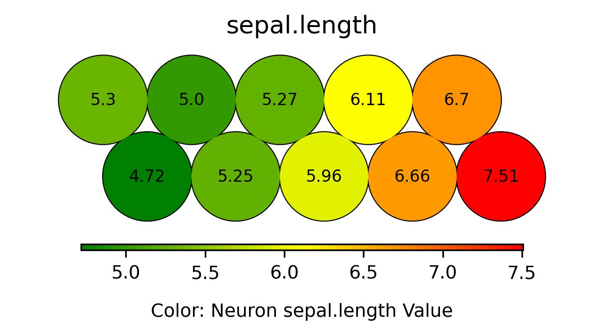
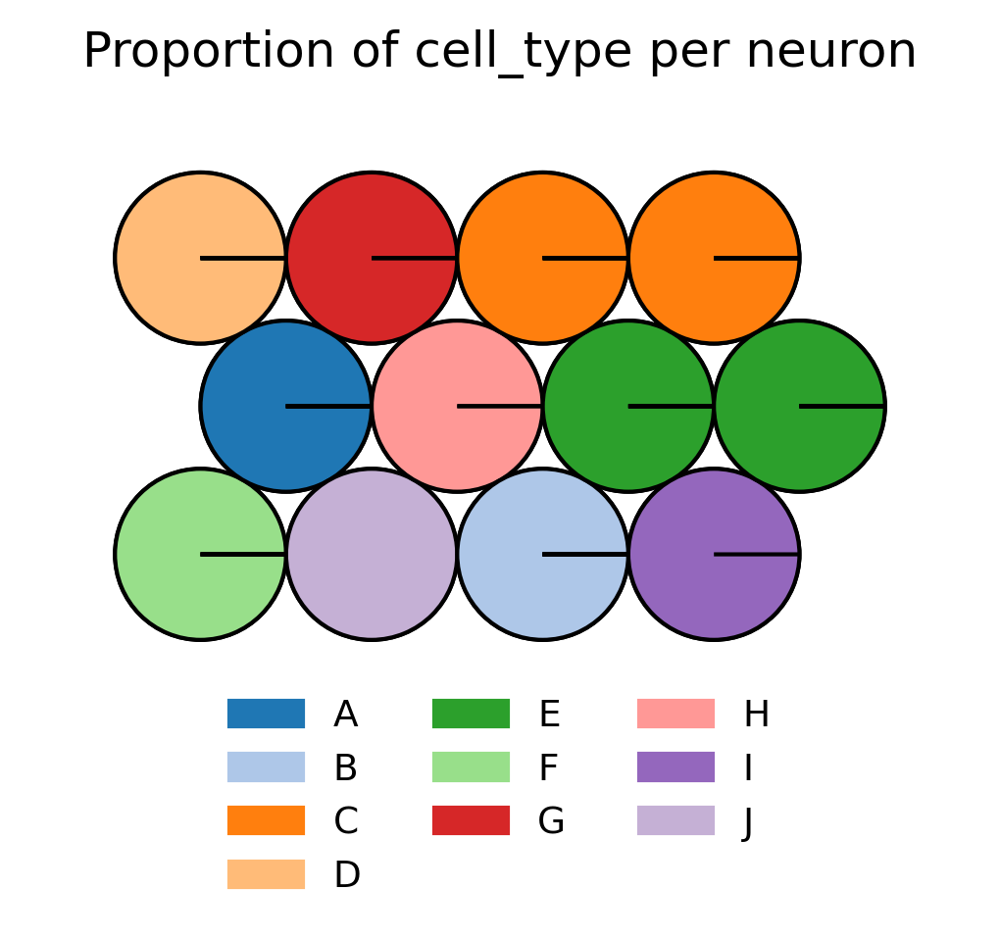

# Self-Organizing Maps (SOM)

This repository provides an implementation of Self-Organizing Maps (SOMs), a clustering and visualization tool for high-dimensional data. The framework includes utilities, example scripts, and sample data to demonstrate the SOM's capabilities.

## What is a SOM?

A SOM is a type of unsupervised neural network, designed to cluster and represent data by grouping similar data points. Unlike traditional clustering methods, SOMs map complex, high-dimensional datasets onto a simplified two-dimensional grid. This makes SOMs a valuable tool for identifying patterns and relationships within complex datasets.

<div align="center">
    <br>
    
    <br>
    <a href="https://ritikpatel17.medium.com/self-organising-maps-a-brief-overview-6f6ff3c0168a">Image Source</a>
</div>

## How do SOMs work?

SOMs create a **grid of neurons**, representing clusters in a two-dimensional space that can be visualized. Each neuron is linked to a **weight vector** extending into the original high-dimensional input space. These weight vectors function similarly to centroids in k-means clustering by summarizing the data points associated with each neuron.

Unlike k-means, where centroids exist independently, SOM neurons are arranged on a structured 2D grid. During training, the weight vectors of neighboring neurons are updated together, ensuring that SOMs preserve the **topology** of the input data. This means that similar data points in the original space are mapped to neurons located near each other on the grid.

After training (i.e., once the weight vectors have been optimized), data points are mapped to the neuron whose weight vector is closest, based on a distance metric such as Euclidean distance, as used in this SOM implementation.

The resulting 2D map does more than cluster data—it reveals relationships between clusters, offering a visual representation of the structure and patterns in complex datasets. This combination of grid-based organization and dynamic neighborhood updates makes SOMs uniquely powerful for both clustering and visualization.

## Visualization with SOMs: Exploring Data Layers

One of the powerful features of SOMs is their ability to act as a visual map for exploring different aspects of your data. Similar to a geographic map that displays various layers—such as terrain, satellite, or traffic—a SOM allows you to visualize distinct "layers" of information within your dataset.

### Visualizing Training Features

Each feature used to train the SOM can be visualized as a **component plane**, a layer that illustrates how the values of that feature are distributed across the map. Think of this as a heatmap overlay on the SOM grid, where each neuron is shaded to represent the value of the feature it captures. For instance, in the example provided in this repository using the Iris dataset, the feature for sepal length has a component plane (shown below) that reveals a gradient, illustrating how sepal length increase across the clusters identified by the SOM from left to right. Component planes for the other features in the dataset are also available for exploration (see here). Examining these component planes offers insights into the patterns detected by the SOM and sheds light on how specific features influence the clustering results.

<div align="center">
    <br>
    
    <br>
</div>

Some datasets, such as the single-cell RNA sequencing data generated in this repository, may have features that are less interpretable or lack clear individual patterns.  Despite this, the SOM integrates all features to create meaningful clusters and structure on the map. In such cases, mapping **non-training categorical data** to the SOM is particularly useful. This enables visualization of how external categories, such as cell types, are distributed across the clusters, offering insights into how the different categories relate to each other. More information on this can be found in the next subsection.

### Visualizing Categorical/Latent Features

Although categorical features are not used during the training of the SOM, they can be mapped to the grid afterward to uncover meaningful relationships between clusters and these external categories. This approach takes advantage of the SOM’s ability to cluster numeric training data into patterns that often align with broader trends in the dataset.

For instance, continuing with the Iris example above, the SOM was trained using numerical features like sepal length. After the map was trained, categorical information such as species was overlaid onto the grid (see below). Despite not being used during training, the SOM's clusters align closely with the different Iris species, highlighting its effectiveness in uncovering underlying relationships.

<div align="center">
    <br>
    
    <br>
</div>


Visualizing categorical features on the map allows exploration of how categories are distributed and interrelated. For example:
- Certain regions of the map may be dominated by a specific category, indicating that clusters in those areas are strongly associated with that label.
- Overlapping or intermixed categories can point to transitional states or shared characteristics among groups.
- Clear separations or gaps between categories highlight distinct boundaries or differences in the data.

A more complex example of this is shown below for single-cell RNA sequencing data generated in the [Seq_Sim directory](../Seq_Sim). In this case, the SOM was trained on 1,000 gene expression features. After training, cell type was overlaid onto the map. Even though cell type was not part of the training process, the visualization shows that each neuron represent a single cell type. This reveals relationships between the cell types: for instance, cell types D and I are positioned on opposite sides of the map, suggesting they are highly distinct, whereas cell types D and G are closer to each other, indicating greater similarity.

<div align="center">
    <br>
    
    <br>
</div>

---

## Directory Structure

``` bash
SOM/
├── utils/
│   └── som_utils.py 
├── data/              
│   ├── iris_categorical_data.csv          
│   ├── iris_training_data.csv     
│   ├── seq_sim_categorical_data.csv
│   ├── seq_sim_training_data.csv 
│   ├── titanic_categorical_data.csv
│   └── titanic_training_data.csv 
├── examples/           
│   ├── output/
│   │   ├── iris/
│   │   ├── seq/
│   │   └── titanic/
│   ├── som_example_iris.py
│   ├── som_example_seq.py
│   └── som_example_titanic.py             
└── som.py                  
```

## Features

- **Core Implementation**: The `som_utils.py` file contains the `SOM` class, which provides functionalities for training, scaling, and visualizing Self-Organizing Maps.
- **Command-Line Interface**: The `som.py` script enables running SOM operations from the command line for integration into pipelines or automation.
- **Example Scripts**: The `examples` directory provides ready-to-run scripts to demonstrate training, clustering, and visualization using the SOM framework.
- **Data Support**: The `data` directory includes sample datasets to test and validate the functionality of the SOM framework.

---
